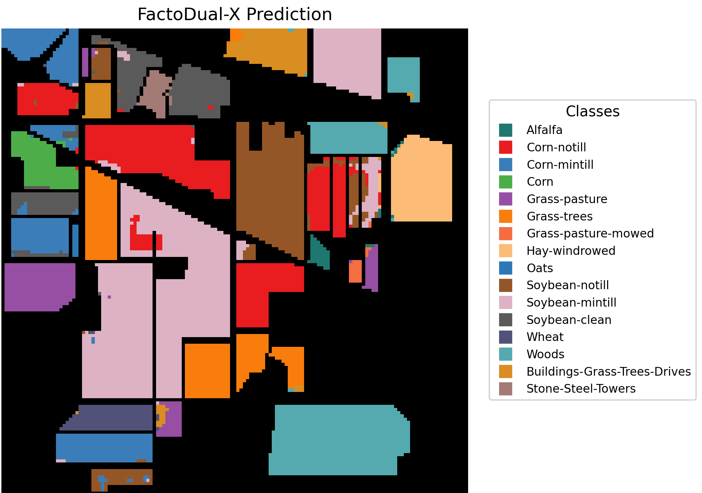
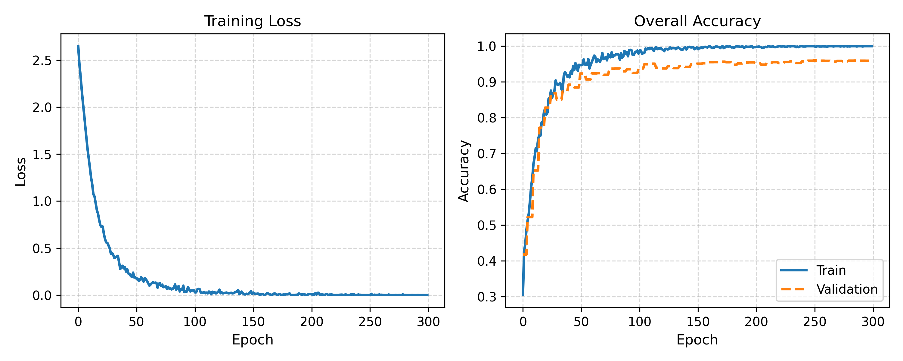

# FactoDual-X

PyTorch implementation of **FactoDual-X**: *A Parallel Factorized Dual-Branch Transformer with Cross-Modal Attention for Hyperspectral Image Classification*, inspired by FactoFormer.

---

## Architecture Overview

FactoDual-X introduces a parallel factorized dual-branch Transformer topology designed to extract spatial and spectral features simultaneously from hyperspectral image (HSI) patches:

1. **3D Patch Embedding**: Divides the input HSI patch into spatial tokens and spectral band-group tokens.
2. **Parallel Encoder Branches**:
   - **Spatial Branch**: Models long-range spatial context using standard self-attention.
   - **Spectral Branch**: Captures spectral correlations and band dependencies in parallel.
3. **Cross-Modal Attention (CMA)**: Fuses spatial and spectral features dynamically, routing information from one branch to another to enrich local representations.



---

## Features

- **Modular PyTorch Architecture**: Decoupled modules for attention, embeddings, block layers, and dataset management.
- **Custom Dual-Branch Fusion**: Dynamic Cross-Modal Attention (CMA) mechanism.
- **Warmup Cosine LR Scheduler**: Native PyTorch scheduler featuring linear warmup and cosine annealing.
- **Automated Logging**: Automatic generation of classification reports, accuracy summaries, and visual prediction maps.
- **Command Line Interface (CLI)**: Hyperparameters can be tuned directly via argparse parameters.

---

## Requirements

- Python >= 3.8
- PyTorch >= 1.8
- NumPy
- SciPy
- Matplotlib
- Scikit-Learn
- Einops

You can install all requirements using `requirements.txt`:

```bash
pip install -r requirements.txt
```

---

## Dataset Download Instructions

This project uses the **Indian Pines** hyperspectral dataset.

1. Download the following mat files:
   - [Indian Pines Corrected](https://www.ehu.eus/ccwintco/uploads/e/e3/Indian_pines_corrected.mat)
   - [Indian Pines Ground Truth](https://www.ehu.eus/ccwintco/uploads/c/c4/Indian_pines_gt.mat)
2. Place both files in the `datasets/` folder:

```text
datasets/
├── Indian_pines_corrected.mat
└── Indian_pines_gt.mat
```

---

## Usage

### 1. Training

To train FactoDual-X from scratch, run:

```bash
python train.py --epochs 300 --batch_size 32 --lr 3e-4
```

This will:
- Set up a deterministic seed (`--seed 42`).
- Train for 300 epochs.
- Save the best model checkpoint to `checkpoints/factodualx_best.pth`.
- Save classification metrics to `results/classification_report.txt`.
- Save the qualitative comparison plot to `images/prediction_map.png`.

### 2. Evaluation

To evaluate a pre-trained model checkpoint on the test set:

```bash
python evaluate.py --checkpoint checkpoints/factodualx_best.pth
```

### 3. Inference

To run inference on the entire hyperspectral image and produce a clean prediction map:

```bash
python inference.py --checkpoint checkpoints/factodualx_best.pth --save_path images/prediction_map_only.png
```

---

## Results

FactoDual-X achieves state-of-the-art performance on the Indian Pines dataset, outperforming competitive baselines including SpectralFormer, MAEST, and FactoFormer:

### Quantitative Comparison

| Model | OA (%) | AA (%) | Kappa ($\kappa$) |
| :--- | :---: | :---: | :---: |
| SpectralFormer | 81.76 | 87.81 | 0.7919 |
| MAEST | 84.15 | 90.97 | 0.8200 |
| FactoFormer | 91.30 | 94.30 | 0.9006 |
| **FactoDual-X (Ours)** | **95.99** | **96.54** | **0.9541** |

### Qualitative Comparisons

#### Training Curves


#### Prediction Map & Ground Truth


---

## Citation

If you find this implementation useful for your research, please cite the corresponding papers:

```bibtex
@article{factodualx2026,
  title={FactoDual-X: A Parallel Factorized Dual-Branch Transformer with Cross-Modal Attention for Hyperspectral Image Classification},
  author={FactoDual-X Contributors},
  year={2026}
}
```

---

## License

This project is licensed under the MIT License - see the [LICENSE](LICENSE) file for details.

---

## Disclaimer

This is an independent open-source PyTorch implementation inspired by the FactoFormer architecture. It is not the official repository of the original FactoFormer paper authors.

---

## Acknowledgements

- Special thanks to Kaustuv Nag for his guidance, support, and valuable contributions to this work.
- Inspiration drawn from the design principles of [FactoFormer](https://arxiv.org/abs/2306.01234).
- Thanks to the researchers behind the Indian Pines hyperspectral dataset.
